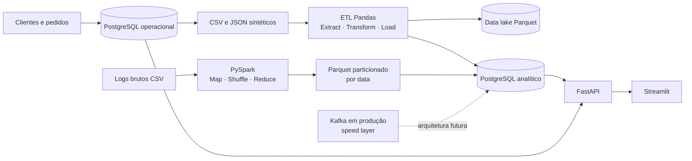

# DataBurguer — Plataforma de Processamento e Análise de Dados para Delivery

MVP acadêmico de Sistemas de Informação que integra banco operacional, transações de pedidos e estoque, ETL de fontes heterogêneas, data lake local em Parquet, processamento de logs com PySpark, camada analítica, API FastAPI e dashboard Streamlit.

O projeto usa PostgreSQL como banco principal. O processamento de logs tenta PySpark por padrão e possui fallback Pandas identificado nos logs para permitir a demonstração em máquinas sem Java. Não há simulação enganosa de centenas de GB: o MVP usa 10 mil registros por padrão e documenta a evolução para escala real.

## Demonstração pública

O painel de apresentação está publicado em:

**https://databurguer-mvp.vercel.app**

A versão pública é um snapshot dos resultados reais produzidos pelo pipeline validado em PostgreSQL. O ambiente operacional completo — transações, ETL, processamento e atualização persistente — continua sendo executado localmente com Docker, FastAPI e Streamlit. Os arquivos da apresentação pública ficam em `vercel-demo/`.

## Objetivo e problema

Uma operação de delivery precisa registrar vendas sem inconsistência de estoque, integrar dados imperfeitos vindos de CSV/JSON e analisar muitos logs sem sobrecarregar o banco transacional. O DataBurguer separa essas responsabilidades e produz indicadores verificáveis a partir dos dados gerados.

## Arquitetura



- **Operacional:** `clientes`, `produtos`, `pedidos`, `itens_pedido` e `pagamentos`.
- **ETL:** leitura, validação, limpeza, deduplicação, integração e carga.
- **Data lake:** `data/raw`, `data/processed` e `data/curated`, com Parquet.
- **Logs:** PySpark local; agregações por cidade, estado, página, hora, data e status.
- **Serving:** tabelas `analytics_*`, API e dashboard.

## Tecnologias

Python 3.12, PostgreSQL 16, SQLAlchemy 2, FastAPI, Pydantic 2, Pandas, PyArrow, PySpark 3.5, Streamlit, Faker, Pytest, Docker e Docker Compose.

## Estrutura

```text
databurguer/
├── app/                  # banco, modelos, schemas, serviço e API
├── dashboard/app.py      # painel Streamlit e cadastro de pedido
├── data/
│   ├── raw/              # CSV, JSON e logs de entrada
│   ├── processed/logs/   # logs Parquet particionados
│   └── curated/          # saídas limpas e agregações
├── docs/                 # documentação acadêmica e roteiro
├── pipelines/
│   ├── etl/              # extract, transform, load e orquestração
│   └── logs/             # geração, agregação e job Spark
├── scripts/              # seed, fontes, logs e preparação completa
├── tests/                # testes unitários e de integração local
├── docker-compose.yml
├── Dockerfile
└── requirements.txt
```

## Instalação no Windows 10/11

Pré-requisitos: Docker Desktop aberto, Python 3.12 (ou 3.11 estável compatível) e, apenas para Spark fora do Docker, Java 17. Confira as versões instaladas com `py -0p`.

```powershell
cd caminho\para\databurguer
py -3.12 -m venv .venv
.\.venv\Scripts\Activate.ps1
python -m pip install --upgrade pip
pip install -r requirements.txt
Copy-Item .env.example .env
```

Se o `py -0p` não listar 3.12, troque apenas a primeira linha por `py -3.11 -m venv .venv`. O contêiner continua usando Python 3.12.

Se o PowerShell bloquear a ativação, use no terminal atual:

```powershell
Set-ExecutionPolicy -Scope Process Bypass
```

## Como rodar do zero

1. Abra o Docker Desktop e aguarde o motor iniciar.
2. Suba somente o PostgreSQL:

```powershell
docker compose up -d postgres
docker compose ps
```

Se o Docker Desktop no Windows informar que `docker compose` não é reconhecido, use o executável equivalente instalado com ele:

```powershell
docker-compose up -d postgres
docker-compose ps
```

3. Prepare todo o MVP (seed, fontes, ETL, logs e analytics):

```powershell
python scripts/run_all.py --log-rows 10000
```

4. Em dois terminais com a virtualenv ativa:

```powershell
uvicorn app.main:app --reload
```

```powershell
streamlit run dashboard/app.py
```

Endereços:

- API: `http://localhost:8000`
- Swagger: `http://localhost:8000/docs`
- Dashboard: `http://localhost:8501`

Alternativamente, suba tudo em contêineres:

```powershell
docker compose up --build
docker compose exec api python scripts/run_all.py --log-rows 10000 --log-engine spark
```

## Comandos individuais

```powershell
python scripts/seed_database.py
python scripts/generate_source_data.py
python pipelines/etl/pipeline.py
python scripts/generate_logs.py --rows 10000
python pipelines/logs/spark_job.py --engine auto
pytest
```

Use `--engine spark` para exigir Spark (falha claramente se Java/Spark não estiverem disponíveis) ou `--engine pandas` para uma demonstração leve. `auto` tenta Spark e registra quando usa o fallback.

## API e exemplo de pedido

Principais endpoints: `GET /health`, `/clientes`, `/produtos`, `/pedidos`, `/analytics/resumo`, `/analytics/vendas`, `/analytics/clientes`, `/analytics/logs`, `/analytics/acessos-por-cidade`, `/analytics/acessos-por-pagina` e `/analytics/acessos-por-hora`.

```powershell
$body = @{
  cliente_id = 1
  itens = @(
    @{ produto_id = 1; quantidade = 2 },
    @{ produto_id = 5; quantidade = 1 }
  )
  forma_pagamento = "PIX"
} | ConvertTo-Json -Depth 4

Invoke-RestMethod -Method Post -Uri http://localhost:8000/pedidos `
  -ContentType "application/json" -Body $body
```

O preço não é aceito no payload: ele é lido no servidor. Produtos são bloqueados com `SELECT ... FOR UPDATE`, o estoque é verificado e pedido, itens, baixa e pagamento são confirmados na mesma transação. Qualquer falha provoca rollback.

## Desafio 1 — banco operacional

Os modelos SQLAlchemy implementam todos os relacionamentos. `app/services/orders.py` concentra a regra atômica: valida cliente e produtos, trava as linhas de produto no PostgreSQL, calcula valores, baixa o estoque e cria o pagamento. Os testes demonstram sucesso, estoque insuficiente e rollback após uma falha simulada no pagamento.

## Desafio 2 — ETL

- **Extract:** lê `clientes.csv`, `pedidos.csv` e `pagamentos.json`, verifica colunas e registra contagens em `etl_execucoes`.
- **Transform:** normaliza texto/cidades/datas, trata ausências, remove duplicidades, valida valores e integra as fontes.
- **Load:** grava Parquet e as tabelas `analytics_clientes`, `analytics_vendas_diarias` e `analytics_resumo_vendas` no PostgreSQL.

Não existe ranking de clientes. A análise por pessoa contém somente quantidade, valor, ticket médio, última compra e forma de pagamento predominante.

## Desafio 3 — Spark e MapReduce

No Spark, a projeção de uma dimensão é o **map** conceitual, `groupBy` provoca o **shuffle** distribuído e `count` executa o **reduce**. O job calcula cidade, estado, página, hora, data, status HTTP, total, válidos e erros. As saídas pequenas são carregadas no PostgreSQL analítico; o conjunto detalhado permanece no data lake.

Os logs processados são gravados em `data/processed/logs/data=AAAA-MM-DD/`. O Spark usa `spark.sql.sources.partitionOverwriteMode=dynamic`: apenas as partições presentes na execução são substituídas. O fallback Pandas aplica a mesma regra, recriando apenas cada diretório de data recebido e preservando os demais dias.

## Arquitetura Lambda

- **Batch layer implementada:** arquivos históricos, ETL, Spark/Pandas e Parquet.
- **Serving layer implementada:** PostgreSQL analítico, FastAPI e Streamlit.
- **Speed layer conceitual:** Kafka receberia eventos e atualizaria visões de baixa latência.

**O MVP implementa principalmente a camada batch e serving. A camada de streaming é apresentada arquiteturalmente para manter o projeto executável localmente.** Kafka não está instalado nem é apresentado como implementado.

## Isolamento do banco operacional

O job de logs nunca consulta pedidos ou produtos. Ele lê arquivos, processa em Spark, grava Parquet e envia somente agregados pequenos para tabelas analíticas. Em produção, isso protege o PostgreSQL operacional contra varreduras pesadas, contenção de CPU/I/O e degradação das transações de venda.

## Dashboard

O painel mostra clientes, pedidos, faturamento, ticket médio, acessos e erros HTTP. Há gráficos de pedidos/faturamento por dia, cidade, página, hora, status e pagamento. A aba operacional lista estoque e permite criar um pedido real pela API.

## Testes

```powershell
pytest
python -m compileall app pipelines scripts dashboard tests
```

Os testes usam SQLite somente como banco efêmero e isolado da suíte; isso acelera o CI e **não substitui o PostgreSQL principal**. A validação final de integração deve executar `run_all.py` contra o PostgreSQL do Compose.

## Evidências para apresentar ao professor

1. `docker compose ps` e `GET /health` mostram o PostgreSQL conectado.
2. Consulte um produto, crie um pedido no Swagger e consulte-o novamente: o estoque cai.
3. Tente quantidade maior que o estoque: a API bloqueia sem pedido parcial.
4. Mostre `data/raw` com inconsistências e `data/curated` com Parquet limpo.
5. Abra `etl_execucoes` para as contagens de processamento.
6. Execute o job e mostre as partições `data=...` preservadas.
7. Compare as agregações no dashboard com os Parquets em `log_aggregates`.
8. Rode `pytest` e destaque o teste de rollback.

## Limitações do MVP

- Execução local e carga sintética; sem alta disponibilidade ou autenticação.
- Spark em modo local, não em cluster; o fallback Pandas não é distribuído.
- Sem Kafka/streaming real, Airflow, catálogo de dados, observabilidade central ou LGPD completa.
- A geolocalização é sintética e não deriva do IP.
- `run_all.py` recria os dados acadêmicos para produzir uma demonstração determinística.

## Escala para 500 GB / 600 milhões de registros

Em produção, arquivos iriam para S3/MinIO/HDFS, particionados por data e compactados; Spark rodaria em cluster com leitura incremental, ajuste de partições e formatos colunares. Kafka comporia a speed layer. Airflow orquestraria dependências, retries e qualidade. Agregados seriam servidos por ClickHouse, BigQuery ou outro data warehouse, enquanto PostgreSQL ficaria reservado ao OLTP. Também seriam necessários schema registry, catálogo/linhagem, monitoramento, políticas de retenção, anonimização e testes de volume.

## Solução de problemas

- `docker API ... pipe ... não encontrado`: abra o Docker Desktop.
- porta 5432 ocupada: pare o PostgreSQL conflitante ou altere o mapeamento no Compose e `.env`.
- `JAVA_GATEWAY_EXITED`: instale Java 17 e defina `JAVA_HOME`, use Docker, ou execute `--engine pandas`.
- `psycopg.OperationalError`: confirme `docker compose ps`, `.env` e aguarde o healthcheck.
- Scripts devem ser executados a partir da raiz do projeto.
